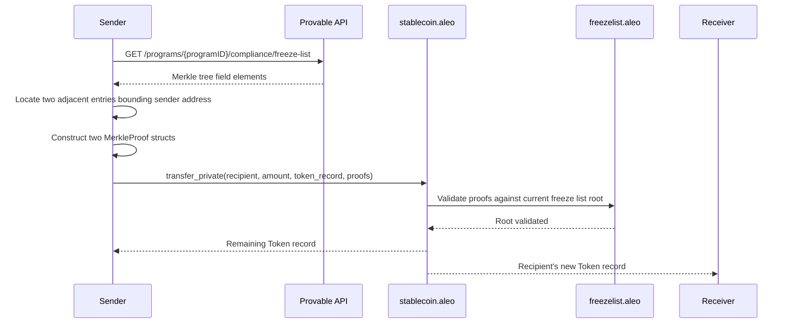

import StablecoinEntry from '@site/src/components/StablecoinEntry';

Two privacy-preserving stablecoins are currently live on Aleo Mainnet:

<StablecoinEntry
  name="USDCx"
  url="https://aleo.org/usdcx/"
  logo="/img/tokens/usdcx.svg"
  externalLink
  noTopPadding
  links={[
    { label: 'Mainnet Program', url: 'https://explorer.provable.com/program/usdcx_stablecoin.aleo' },
    { label: 'Testnet Program', url: 'https://testnet.explorer.provable.com/program/test_usdcx_stablecoin.aleo' },
  ]}
>

A privacy-preserving stablecoin developed in partnership with Circle. USDCx is backed 1:1 by native USDC locked in [Circle xReserve](https://www.circle.com/blog/usdcx-on-aleo-testnet-via-circle-xreserve) smart contracts on Ethereum. When a user deposits USDC, an equivalent amount of USDCx is minted on Aleo.
Privacy features apply exclusively to USDCx while it remains on Aleo — bridging back to other blockchains removes these protections.

</StablecoinEntry>

<StablecoinEntry
  name="USAD"
  url="https://aleo.org/usad/"
  logo="/img/tokens/usad.svg"
  externalLink
  noBorder
  noBottomPadding
  links={[
    { label: 'Mainnet Program', url: 'https://explorer.provable.com/program/usad_stablecoin.aleo' },
    { label: 'Testnet Program', url: 'https://testnet.explorer.provable.com/program/test_usad_stablecoin.aleo' },
  ]}
>

A privacy-preserving stablecoin developed in partnership with Paxos Labs. USAD is backed by USDG (Global Dollar).  USAD keeps sensitive information — including participant identities and transaction amounts — confidential, while remaining compliant to regulatory oversight.

</StablecoinEntry>

## Compliance Features

The stablecoin programs integrate several key privacy-preserving compliance features:

{/* - A **multisig core** program for admin operations requiring multi-signature approval
- A **freeze list** program to enforce compliance controls on token holders
- A **Merkle tree** program for efficient, privacy-preserving membership proofs */}


### Freeze List
Addresses on the freeze list are blocked from all public transfers. Private transfers enforce the same restriction without revealing the sender's address: the sender supplies a Merkle non-membership proof demonstrating their address is not a leaf in the freeze list tree.

### Compliance Records

Every operation that crosses the public/private boundary (`mint_private`, `burn_private`, and `transfer_public_to_private`) emits a `ComplianceRecord` to a designated compliance officer address. This gives the issuer an audit trail for regulatory purposes without exposing information publicly onchain.

### Multisig-based Admin

Admin operations are gated by an onchain multisig program, which requires multiple signers — identified by both Aleo addresses and ECDSA keys — to authorize sensitive changes such as role updates and program initialization.

The underlying pattern — an Aleo smart contract wallet authorized by ECDSA signatures — is demonstrated in the [`virtual_wallet` Leo example](https://github.com/ProvableHQ/leo-examples/tree/main/virtual_wallet). This example is particularly useful for **custodians** who need to manage onchain assets using existing ECDSA key infrastructure (HSMs, existing Ethereum signing keys) without exposing a native Aleo private key as the authority. It shows how to deploy a program that accepts secp256k1 ECDSA signatures as its authorization mechanism, using an ephemeral Aleo key for transaction signing while ECDSA keys retain spending authority.


{/* 
## Key features

- Public and private token balances
- Role-based access control (admin, minter, burner)
- Compliance via a freeze list with Merkle proof-based enforcement
- Credential-gated private transfers: senders must prove they are not frozen
- Compliance records emitted for every mint, burn, and public-to-private transfer
- Pause mechanism for emergency halts
- Multisig-protected administrative operations */}

{/* ## Usage

Addresses with the `MINTER_ROLE` or `ADMIN_ROLE` can mint tokens via `mint_public` / `mint_private`. Addresses with `BURNER_ROLE` or `ADMIN_ROLE` can burn tokens via `burn_public` / `burn_private`.

Token holders transfer publicly using `transfer_public` or privately using `transfer_private`. Private transfers require the sender to fetch the current freeze list Merkle tree via the Provable API, compute two adjacent `MerkleProof` structs that lexicographically bound their address (proving non-membership), and pass those proofs directly to `transfer_private`.

Public balances can be converted to private token records via `transfer_public_to_private`, and private records can be converted back via `transfer_private_to_public`. An allowance mechanism (`approve_public`, `unapprove_public`, `transfer_from_public`, `transfer_from_public_to_private`) lets third parties spend tokens on behalf of owners.

### Private Transfer Flow

Private transfers enforce freeze list compliance without revealing the sender's address onchain. The sender proves non-membership in the freeze list by supplying a pair of adjacent Merkle tree entries that lexicographically bound their address.



### Freeze list API

To obtain the Merkle tree data needed for a private transfer, query the Provable Explorer API:

```
GET https://api.explorer.provable.com/v2/programs/{programID}/compliance/freeze-list
```

| Parameter | Type | Description |
|-----------|------|-------------|
| `programID` | path (string) | The stablecoin program ID, e.g. `usdcx_stablecoin.aleo` |

**Response:** an array of Merkle tree field elements representing the current freeze list. Use these to compute the two adjacent `MerkleProof` structs required by `transfer_private`.

Full API reference: [Provable Explorer API v2 — Compliance Freeze List](https://docs.explorer.provable.com/docs/api/v2/get-program-program-id-compliance-freeze-list). */}

## Data Structures

### `Token`

```leo
record Token {
    owner: address,
    amount: u128,
}
```
The private state representation of the token.

### `ComplianceRecord`

```leo
record ComplianceRecord {
    owner: address,
    amount: u128,
    sender: address,
    recipient: address,
}
```

Emitted on every `mint_private`, `burn_private`, `transfer_public_to_private`, and `transfer_from_public_to_private` call, providing an audit trail for the compliance officer without revealing data publicly onchain.

### `Credentials`

```leo
record Credentials {
    owner: address,
    freeze_list_root: field,
}
```

Must be obtained via `get_credentials` before calling `transfer_private`. Certifies that the holder's address is not on the freeze list at the proven Merkle root.

### `TokenInfo`

```leo
struct TokenInfo {
    name: u128,        // ASCII text encoded as u128 bitstring
    symbol: u128,      // ASCII text encoded as u128 bitstring
    decimals: u8,
    supply: u128,
    max_supply: u128,
}
```
Metadata for the token.

### `TokenAllowance`

```leo
struct TokenAllowance {
    account: address,
    spender: address,
}
```
Used to authorize another address to transfer public tokens on your behalf.

### `MerkleProof`

```leo
struct MerkleProof {
    siblings: [field; 16],
    leaf_index: u32,
}
```

Used in `get_credentials` and `transfer_private` to prove non-membership (or membership) in the freeze list. The tree is depth 16; `siblings` contains one sibling hash per level.

### `ChecksumEdition`

```leo
struct ChecksumEdition {
    checksum: [u8; 32],
    edition: u16,
}
```

### `AdminOp`

```leo
struct AdminOp {
    op: u8,
    threshold: u8,
    aleo_signer: address,
    ecdsa_signer: [u8; 20],
}
```

## Mappings

| Mapping | Type | Description |
|---|---|---|
| `token_info` | `boolean -> TokenInfo` | Stores token metadata at key `true` (single entry). |
| `balances` | `address -> u128` | Public token balance per address. |
| `allowances` | `field -> u128` | BHP256 hash of a `TokenAllowance` struct. |
| `address_to_role` | `address -> u16` | Role bitmask per address. |
| `pause` | `boolean -> boolean` | Paused state at key `true`. When `true`, all minting, burning, and transfers are blocked. |

## Roles

Roles are stored as a bitmask in `address_to_role`. An address may hold multiple roles simultaneously.

| Role | Bitmask | Description |
|------|---------|-------------|
| `MINTER_ROLE` | `1u16` | Can call `mint_public` and `mint_private` |
| `BURNER_ROLE` | `2u16` | Can call `burn_public` and `burn_private` |
| `ADMIN_ROLE` | `8u16` | Can call all privileged functions including `update_role` |

An address with `ADMIN_ROLE` can assign or revoke roles for other addresses. An admin cannot remove their own `ADMIN_ROLE`.

## Functions

### `initialize`

```leo
fn initialize(
    public name: u128,
    public symbol: u128,
    public decimals: u8,
    public max_supply: u128,
    public admin: address,
) -> Future
```

Initializes the stablecoin program with its token metadata and sets the initial admin. Callable once, only by the deployer.

#### Parameters

| Name | Type | Description |
|---|---|---|
| `name` | `public u128` | Token name encoded as ASCII |
| `symbol` | `public u128` | Token symbol encoded as ASCII |
| `decimals` | `public u8` | Number of decimal places |
| `max_supply` | `public u128` | Maximum allowed supply |
| `admin` | `public address` | Initial admin address |

[Back to Top](#functions)

---

### `update_role`

```leo
fn update_role(
    public account: address,
    private role: u16,
) -> Future
```

Assigns a new role bitmask to a target address. The caller must have `ADMIN_ROLE`. An admin cannot remove their own `ADMIN_ROLE`.

#### Parameters

| Name | Type | Description |
|---|---|---|
| `account` | `public address` | Address to update |
| `role` | `private u16` | New role bitmask to assign |

[Back to Top](#functions)

---

### `get_signing_op_id_for_deploy`

```leo
fn get_signing_op_id_for_deploy(
    private checksum: [u8; 32],
    private edition: u16,
) -> field
```

Utility function that computes the signing operation ID for a program deployment, used in multisig admin flows. Returns the BHP256 hash of the `ChecksumEdition` struct.

#### Parameters

| Name | Type | Description |
|---|---|---|
| `checksum` | `private [u8; 32]` | Deployment checksum |
| `edition` | `private u16` | Deployment edition |

[Back to Top](#functions)

---

### `get_credentials`

```leo
fn get_credentials(
    private proofs: [MerkleProof; 2],
) -> (Credentials, Future)
```

Proves that the transaction signer is not on the freeze list by verifying two adjacent Merkle proofs against the current freeze list root. The function confirms the signer's address falls lexicographically between the two consecutive leaf entries, establishing non-membership. Returns a `Credentials` record required to call `transfer_private`.

#### Parameters

| Name | Type | Description |
|---|---|---|
| `proofs` | `private [MerkleProof; 2]` | Two adjacent proofs bounding the signer's address in the freeze list tree |

[Back to Top](#functions)

---

### `mint_public`

```leo
fn mint_public(
    public recipient: address,
    public amount: u128,
) -> Future
```

Mints tokens to a public balance. Requires `MINTER_ROLE` or `ADMIN_ROLE`. The program must not be paused; new supply must not exceed `max_supply`.

#### Parameters

| Name | Type | Description |
|---|---|---|
| `recipient` | `public address` | Recipient address |
| `amount` | `public u128` | Number of tokens to mint |

[Back to Top](#functions)

---

### `mint_private`

```leo
fn mint_private(
    private recipient: address,
    public amount: u128,
) -> (ComplianceRecord, Token, Future)
```

Mints tokens to a private `Token` record. Requires `MINTER_ROLE` or `ADMIN_ROLE`. Emits a `ComplianceRecord` to the compliance officer.

#### Parameters

| Name | Type | Description |
|---|---|---|
| `recipient` | `private address` | Recipient address (not visible onchain) |
| `amount` | `public u128` | Number of tokens to mint |

[Back to Top](#functions)

---

### `burn_public`

```leo
fn burn_public(
    public owner: address,
    public amount: u128,
) -> Future
```

Burns tokens from a public balance. Requires `BURNER_ROLE` or `ADMIN_ROLE`. The program must not be paused.

#### Parameters

| Name | Type | Description |
|---|---|---|
| `owner` | `public address` | Address whose tokens are burned |
| `amount` | `public u128` | Number of tokens to burn |

[Back to Top](#functions)

---

### `burn_private`

```leo
fn burn_private(
    input_record: Token,
    public amount: u128,
) -> (Token, ComplianceRecord, Future)
```

Burns tokens from a private `Token` record. Requires `BURNER_ROLE` or `ADMIN_ROLE`. Returns the remaining `Token` along with a `ComplianceRecord`.

#### Parameters

| Name | Type | Description |
|---|---|---|
| `input_record` | `Token` | Token record to burn from |
| `amount` | `public u128` | Number of tokens to burn |

[Back to Top](#functions)

---

### `transfer_public`

```leo
fn transfer_public(
    public recipient: address,
    public amount: u128,
) -> Future
```

Transfers tokens between public balances. Caller is `self.caller`. Both sender and recipient must not be on the freeze list.

#### Parameters

| Name | Type | Description |
|---|---|---|
| `recipient` | `public address` | Recipient address |
| `amount` | `public u128` | Amount to transfer |

[Back to Top](#functions)

---

### `transfer_public_as_signer`

```leo
fn transfer_public_as_signer(
    public recipient: address,
    public amount: u128,
) -> Future
```

Same as `transfer_public`, but uses `self.signer` as the sender — useful inside program call chains where the debit should be attributed to the original transaction signer rather than the immediate caller.

#### Parameters

| Name | Type | Description |
|---|---|---|
| `recipient` | `public address` | Recipient address |
| `amount` | `public u128` | Amount to transfer |

[Back to Top](#functions)

---

### `transfer_private`

```leo
fn transfer_private(
    private recipient: address,
    private amount: u128,
    input_record: Token,
    private proofs: [MerkleProof; 2],
) -> (Token, Token, Future)
```

Transfers tokens between two private `Token` records. The sender must provide two adjacent `MerkleProof` structs proving their address is not on the current freeze list.

#### Parameters

| Name | Type | Description |
|---|---|---|
| `recipient` | `private address` | Recipient address (not visible onchain) |
| `amount` | `private u128` | Amount to transfer (not visible onchain) |
| `input_record` | `Token` | Sender's token record |
| `proofs` | `private [MerkleProof; 2]` | Merkle proofs certifying sender is not on the freeze list |

[Back to Top](#functions)

---

### `transfer_public_to_private`

```leo
fn transfer_public_to_private(
    private recipient: address,
    public amount: u128,
) -> (ComplianceRecord, Token, Future)
```

Converts a public balance to a private `Token` record. Emits a `ComplianceRecord` to the compliance officer. Sender must not be on the freeze list.

#### Parameters

| Name | Type | Description |
|---|---|---|
| `recipient` | `private address` | Private recipient address (not visible onchain) |
| `amount` | `public u128` | Amount to convert |

[Back to Top](#functions)

---

### `transfer_private_to_public`

```leo
fn transfer_private_to_public(
    public recipient: address,
    public amount: u128,
    input_record: Token,
) -> (Token, Future)
```

Converts a private `Token` record to a public balance.

#### Parameters

| Name | Type | Description |
|---|---|---|
| `recipient` | `public address` | Public recipient address |
| `amount` | `public u128` | Amount to convert |
| `input_record` | `Token` | Sender's private token record |

[Back to Top](#functions)

---

### `approve_public`

```leo
fn approve_public(
    public spender: address,
    public amount: u128,
) -> Future
```

Grants a spender the ability to transfer tokens on behalf of the caller, increasing the allowance by the specified amount.

#### Parameters

| Name | Type | Description |
|---|---|---|
| `spender` | `public address` | Address to authorize |
| `amount` | `public u128` | Amount to add to the allowance |

[Back to Top](#functions)

---

### `unapprove_public`

```leo
fn unapprove_public(
    public spender: address,
    public amount: u128,
) -> Future
```

Reduces or revokes a spender's allowance.

#### Parameters

| Name | Type | Description |
|---|---|---|
| `spender` | `public address` | Address to de-authorize |
| `amount` | `public u128` | Amount to subtract from the allowance |

[Back to Top](#functions)

---

### `transfer_from_public`

```leo
fn transfer_from_public(
    public owner: address,
    public recipient: address,
    public amount: u128,
) -> Future
```

Transfers tokens from an owner to a recipient using a pre-approved allowance. Owner and recipient must not be on the freeze list.

#### Parameters

| Name | Type | Description |
|---|---|---|
| `owner` | `public address` | Address to debit |
| `recipient` | `public address` | Address to credit |
| `amount` | `public u128` | Amount to transfer |

[Back to Top](#functions)

---

### `transfer_from_public_to_private`

```leo
fn transfer_from_public_to_private(
    public owner: address,
    private recipient: address,
    public amount: u128,
) -> (ComplianceRecord, Token, Future)
```

Converts a public balance to a private `Token` record on behalf of the owner, using a pre-approved allowance. Emits a `ComplianceRecord` to the compliance officer.

#### Parameters

| Name | Type | Description |
|---|---|---|
| `owner` | `public address` | Address to debit publicly |
| `recipient` | `private address` | Private recipient address (not visible onchain) |
| `amount` | `public u128` | Amount to convert |

[Back to Top](#functions)
