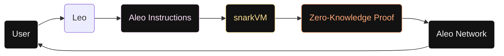

import ScrollReveal from '@site/src/components/ScrollReveal';

# Welcome to Aleo

Aleo is a Layer 1 blockchain that enables developers to build **private applications** using zero-knowledge proofs.

## Getting Started

Declare a new variable in Leo:

```leo
let a: address = aleo1rhgdu77hgyqd3xjj8ucu3jj9r2krwz6mnzyd80gncr5fxcwlh5rsvzp9px;
```

Write your first Leo program and deploy it to the Aleo network:

```leo playground
program hello.aleo {
    transition main(public a: u32, b: u32) -> u32 {
        let c: u32 = a + b;
        return c;
    }
}
```

## Architecture



<ScrollReveal>

## Key Concepts

Aleo uses three types of keys:

| Key | Purpose |
|-----|---------|
| **Private Key** | Signs transactions, derives other keys |
| **View Key** | Decrypts private records and transaction data |
| **Address** | Public identifier, receives funds and records |

</ScrollReveal>

## Math Support

Zero-knowledge proofs rely on elliptic curve cryptography. A point $P$ on an elliptic curve satisfies:

$$
y^2 = x^3 + ax + b \pmod{p}
$$
